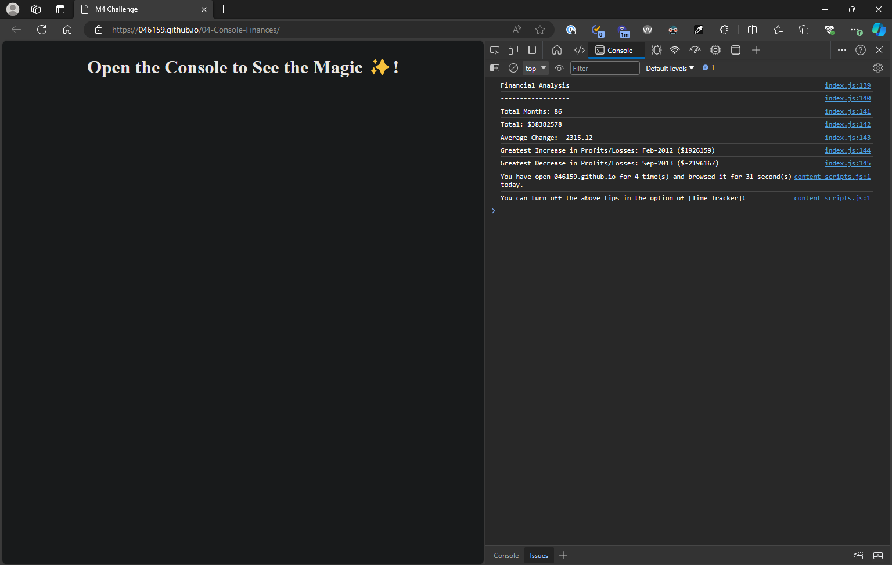

# Challenge 4 - Calculate finances using JavaScript and display to console

## Description 

This project was about using JavaScript to calculate finances and to then display to console.

The URL for the application is: https://046159.github.io/04-Console-Finances/

Below is a screenshot of the completed application:

## Usage 

* Launch the website.
* Run Inspect from Devtools to see the output in the console.

## Credits

The following websites provided valuable input into this challenge:

* https://www.w3schools.com

## License

Please refer to Github for the information on licensing.

## Tests

1. Test that the output in the console is identical to that shown in the instructions for the challenge.

---